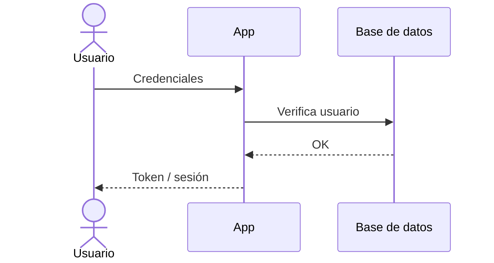

# Autenticación y Autorización

> Cómo se autentican y autorizan los usuarios en **[NOMBRE_DEL_PROYECTO]** — el modelo
> de este proyecto Y las reglas que no cambian al cambiar de herramienta. (Era un par
> `architecture/` + `conventions/` con la misma tabla en los dos lados; se fusionó
> porque siempre se rellenaban y se podaban juntos.)
>
> **Última actualización**: [FECHA]

## Visión general

- **Método de autenticación**: [sesión / JWT / OAuth / SSO].
- **Almacenamiento de credenciales**: [dónde y cómo].
- **Hashing de contraseñas**: [bcrypt / argon2 / …].

## Reglas (valen para cualquier stack)

- La autorización se valida **siempre en el servidor**, en cada request. Nunca confiar
  en checks de cliente para decisiones de seguridad.
- Las contraseñas se almacenan hasheadas con un algoritmo robusto y salt.
- Los tokens/sesiones se rotan en cada login y tienen expiración.
- Los flujos OAuth/SSO se validan server-side (email y UID).
- **Recolectar datos personales de quien no es usuario exige su propio consentimiento**,
  en el punto donde se recolectan. La aceptación de términos al crear cuenta no cubre a
  quien nunca creó una. Condiciona el diseño de esa pantalla, así que se decide antes
  de construirla.

## Actores

Todos los que interactúan con el sistema, **incluidos los que no tienen cuenta**. Esta
tabla va antes que los roles a propósito: un actor sin sesión también tiene autorización
que definir, y es el que más fácil se olvida.

| Actor     | ¿Tiene cuenta? | Credencial                         | Qué puede ver y hacer |
| --------- | -------------- | ---------------------------------- | --------------------- |
| [ACTOR_1] | Sí             | Sesión                             | [alcance]             |
| [ACTOR_2] | No             | [enlace firmado · token · ninguna] | [alcance]             |

Para cada actor sin cuenta, responde también: **¿su credencial caduca?** ¿se puede
compartir? ¿qué pasa si alguien la copia? Un token impreso, enviado por email o puesto en
una URL es público en la práctica: cualquiera que lo vea lo tiene. Si de ahí cuelgan datos
personales, decide qué se muestra **antes** de construirlo.

## Modelo de identidad

| Concepto       | Descripción                            |
| -------------- | -------------------------------------- |
| Usuario        | [Qué representa, campos clave]         |
| Sesión / Token | [Cómo se representa una sesión activa] |
| Roles          | [Roles existentes y su significado]    |

## Flujo de registro / login

## Gestión de sesiones / tokens

- **Expiración**: [TTL].
- **Renovación**: [refresh tokens / rotación].
- **Revocación**: [cómo se invalida una sesión].

## Autorización

- **Modelo**: [RBAC / ABAC / permisos por recurso].
- **Roles y permisos**:

| Rol     | Permisos          |
| ------- | ----------------- |
| [ROL_1] | [Qué puede hacer] |
| [ROL_2] | [Qué puede hacer] |

## Proveedores externos (OAuth / SSO)

- [Proveedor], validación server-side, datos que se consumen.

> **Si la app va a App Store con login social**, la guía 4.8 exige una alternativa
> equivalente en privacidad — el detalle vive en
> [`../conventions/deploy.md`](../conventions/deploy.md) §«Antes de la primera subida»
> (única copia), junto a los otros requisitos de publicación. Decídelo aquí, no al publicar.

## Recuperación de cuenta

- [Flujo de reset de contraseña, cambio de email, verificación].

## Consideraciones de seguridad

Ver [SECURITY.md](../../SECURITY.md) para la política completa.
