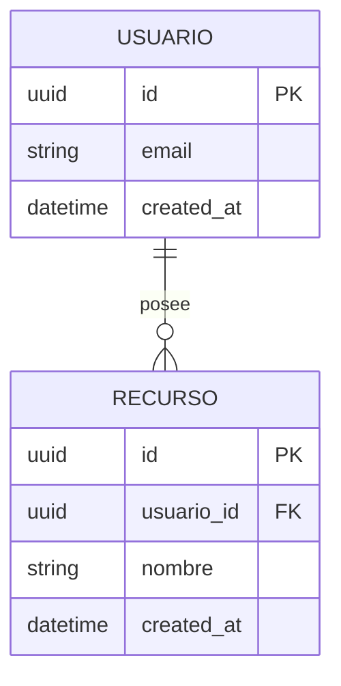

# Modelo de Datos

> Esquema, entidades y relaciones de **[NOMBRE_DEL_PROYECTO]**.
> Para las **reglas y estándares** de modelado (nomenclatura, tipos, índices)
> ver [`../conventions/database.md`](../conventions/database.md).
>
> **Última actualización**: [FECHA]

## Diagrama Entidad-Relación

## Entidades principales

### [ENTIDAD_1]

- **Propósito**: [Qué representa].
- **Campos clave**: [campo (tipo) — descripción].
- **Relaciones**: [con qué otras entidades y con qué cardinalidad].

### [ENTIDAD_2]

- **Propósito**: [Qué representa].
- **Campos clave**: [campo (tipo) — descripción].
- **Relaciones**: [con qué otras entidades y con qué cardinalidad].

## Relaciones y cardinalidad

| Relación                  | Cardinalidad | Notas                 |
| ------------------------- | ------------ | --------------------- |
| [ENTIDAD_A] → [ENTIDAD_B] | 1:N          | [Regla de integridad] |

## Aislamiento entre inquilinos

> **Bórrala si el producto no es multi-tenant.** Si lo es, es la sección más importante
> del documento: un filtro por inquilino que falta no rompe ningún test ni genera un
> error en el monitoreo — simplemente le enseña a un cliente los datos de otro.

- **Qué es el inquilino**: [la entidad que agrupa: organización, agencia, espacio…].
- **Cómo se acota**: [columna en cada tabla · esquema por inquilino · base por inquilino].
- **Dónde se aplica**: [alcance por defecto del ORM, middleware, política de fila…] —
  di **dónde se garantiza**, no solo dónde se escribe. Si depende de que cada consulta
  lo recuerde, es cuestión de tiempo que una no lo haga.
- **Qué pasa si falta**: quién ve qué de quién. Escríbelo explícito; es lo que hace que
  la revisión humana del esquema tenga algo concreto que buscar.
- **Tablas exentas** y por qué: [catálogos, tablas de sistema…].

## Sincronización sin conexión

> **Bórrala si todo pasa en línea.** Si el producto escribe sin señal —una app móvil,
> normalmente—, esto es tan consecuente como el aislamiento entre inquilinos y falla igual
> de callado: los datos se duplican o se pisan y nadie ve un error.

- **Qué se puede crear o editar sin señal**: [entidades]. Y **qué no**, dicho explícito.
- **Identidad**: [UUID generado en el cliente · id local + id de servidor]. Es lo que hace
  que reintentar un envío no duplique el registro — la red móvil falla y los requests se
  reintentan solos.
- **Estado de sincronización**: [campo, valores posibles, dónde vive].
- **Quién gana un conflicto**: [el último en escribir · el servidor · fusión por campo], y
  **qué ve la persona** cuando ocurre. «No pasará» no es una respuesta: pasa con dos
  dispositivos y con una app que estuvo una semana sin abrirse.
- **Qué se borra y cuándo** del almacén local.

## Índices y restricciones

- [Índice/restricción importante y por qué existe].
- [Restricción de unicidad, FK, check, etc.].

## Datos semilla (seeds)

- [Qué datos base se cargan y con qué comando — `[COMANDO_SEEDS]`].
