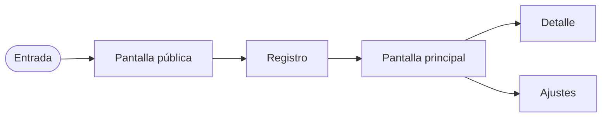

# Mapa de pantallas — [NOMBRE_DEL_PROYECTO]

> Qué pantallas tiene el producto, para qué sirve cada una y **por dónde va**. Es la
> salida del paso "Mapear" del sprint de definición
> ([`../conventions/workflow.md`](../conventions/workflow.md)) y el tablero de avance de
> la UI: se actualiza cada vez que una vista cambia de estado.
>
> Aquí **no** se decide cómo se ve (eso es [`design/`](../../design/README.md)) ni cómo
> se organiza el código de las vistas (eso es
> [`../conventions/ui.md`](../conventions/ui.md)). Las decisiones de diseño de un cambio
> concreto van en el `design.md` de su spec; las duraderas, en un
> [ADR](../decisions/README.md).
>
> **Última actualización**: [FECHA]

## Estados

| Estado        | Significa                                                       |
| ------------- | --------------------------------------------------------------- |
| **mapa**      | Existe la decisión de que haga falta. Nada construido.          |
| **prototipo** | Maquetada en estático con `/prototipo`, navegable y criticable. |
| **conectada** | Con datos reales, sus cuatro estados y revisada en ambos temas. |

Una vista no pasa a **conectada** sin loading, empty, error y éxito — ver
[`../conventions/ui.md`](../conventions/ui.md).

## Pantallas

Parte del catálogo estándar (públicas, legales, auth, app) y añade las propias del
recorrido crítico, para que ninguna se descubra a mitad del desarrollo.

| Vista          | Ruta    | Propósito             | Estado |
| -------------- | ------- | --------------------- | ------ |
| [Landing]      | `/`     | [Convertir visitante] | mapa   |
| [Vista propia] | [/ruta] | [Acción de valor]     | mapa   |

## Mapa de navegación

Cómo se llega a cada pantalla. Es el mapa de sitio y el flujo de usuario a la vez: los
nodos son las pantallas de la tabla de arriba y las flechas, lo que la persona puede
hacer. **Se actualiza en el mismo PR que añade o quita una pantalla** — un diagrama
desactualizado es peor que ninguno, porque se lee como autoridad y nadie lo verifica.

> Sustituye los nodos por los tuyos. Si el producto **no tiene interfaz**, borra esta
> sección entera y el documento: la superficie de una CLI se describe en
> [`architecture.md`](architecture.md) (ver la variante sin interfaz de
> [`../conventions/workflow.md`](../conventions/workflow.md)).

## Recorrido crítico

El camino que la v1 debe hacer impecable, en orden
(el recorrido que hace que el producto valga la pena):

[vista → vista → vista]

## Pantallas que no van a existir

Lo que se decidió **no** construir, para no re-discutirlo cada vez que alguien lo eche
de menos:

| Vista descartada | Por qué | ¿Qué señal la haría entrar? |
| ---------------- | ------- | --------------------------- |
|                  |         |                             |
